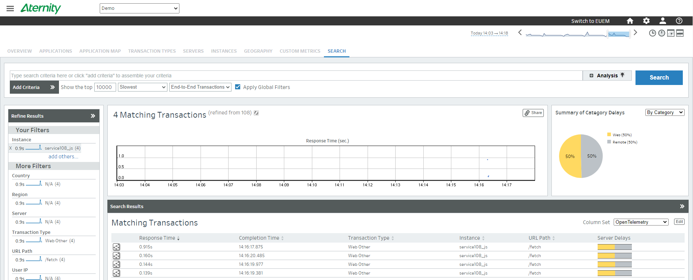

# 108-collect-zipkin-nodejs-app

In this cookbook, the APM collects the telemetry of a **nodejs** webapp that is instrumented with [Zipkin](https://zipkin.io/). The [APM OpenTelemetry Collector](https://hub.docker.com/r/aternity/apm-collector) container is deployed next to the web app and collects every trace.


The [APM OpenTelemetry Collector](https://hub.docker.com/r/aternity/apm-collector) can collect OTLP, the OpenTelemetry native telemetry protocols, as well as Jaeger and Zipkin telemetry. Here it collects Zipkin telemetry like in the other [Riverbed-Community-Toolkit Cookbook 104](../104-opentelemetry-zipkin-nodejs-app) where the app is instrumented with OpenTelemetry.

## Prerequisites

1. an APM account (SaaS)
2. a Docker host, for example [Docker Desktop](https://www.docker.com/products/docker-desktop)

## Step by Step

### 1. Get your CustomerID & SaaS Analysis Server Host details from the APM web console

Navigate to APM (for example [https://apm.myaccount.aternity.com](https://apm.myaccount.aternity.com)) > Agents > Install Agents:

1. Find your **CustomerID**, for example *12341234-12341234-13241234*
2. Grab **SaaS Analysis Server Host**, for example *agents.apm.myaccount.aternity.com*

Those information are required to activate the APM OpenTelemetry Collector container, passing via the environment variable `SERVER_URL`. 

### 2. Start the containers

Download a local copy of the  [docker-compose.yaml](docker-compose.yaml) file, for example in the directory `Tech-Community/108-collect-zipkin-nodejs-app`

Start the containers using the [docker-compose.yaml](docker-compose.yaml), for example with Bash:

```bash
cd Riverbed-Community-Toolkit/APM/108-collect-zipkin-nodejs-app

# Configure the environment variables for the APM OpenTelemetry Collector
export ATERNITY_SAAS_SERVER_HOST="agents.apm.myaccount.aternity.com"
export ATERNITY_CUSTOMER_ID="12341234-12341234-13241234"

docker-compose up
```

or with PowerShell:

```PowerShell
cd Riverbed-Community-Toolkit/APM/108-collect-zipkin-nodejs-app

# Configure the environement variable for the APM OpenTelemetry Collector
$env:ATERNITY_SAAS_SERVER_HOST="agents.apm.myaccount.aternity.com"
$env:ATERNITY_CUSTOMER_ID="12341234-12341234-13241234"

docker-compose up
```

### 3. Use the app to generate some telemetry

The application should now be running. Every trace is collected by the APM OpenTelemetry Collector.

Navigate to http://localhost:8108/fetch from a browser or call the url from a command line. 


For example using curl:

```bash
curl http://localhost:8108/fetch
```

### 4. Open the APM web console to visualize and analyze the traces collected for every transaction

Search transaction, browse the spans for the selected transaction :



## Notes 

### Stop the app and all the containers

Press CTRL + C in the shell where it is running.

Or in a shell, go to the folder where you keep the [docker-compose.yaml](docker-compose.yaml) and run:

```shell
docker-compose down
```

### More details

The cookbook contains few files:
- [app_with_zipkin.js](app.js) is a simple web app that listens http request (using Express) and exposes a `/fetch` method. It is instrumentated using Zipkin.
- [Dockerfile](Dockerfile) defines the docker image to build integrating the zipkin instrumented libraries for the web app (Express and axios)
- [docker-compose.yaml](docker-compose.yaml) is the main file that defines the multi-containers app with two services: the instrumented nodejs web app and the APM OpenTelemetry Collector 

In the [docker-compose.yaml](docker-compose.yaml), on the APM OpenTelemetry Collector section, the image is set to be downloaded from [DockerHub](https://hub.docker.com/r/aternity/apm-collector) and the port to receive Zipkin telemetry is open.

The only thing that needs to be configured is the `SERVER_URL` variable. It contains the Aternity CustomerID and SaaS Analysis Server Host that allow the container to connect to the Aternity SaaS service and get activated. The APM OpenTelemetry Collector section is simple:

```yaml
services:

  opentelemetry-collector:
    
    image: registry.hub.docker.com/aternity/apm-collector:2022.3.0-3
    
    container_name: aternity-opentelemetry-collector       
    
    environment:

      SERVER_URL: "wss://${ATERNITY_SAAS_SERVER_HOST}/?RPM_AGENT_CUSTOMER_ID=${ATERNITY_CUSTOMER_ID}"

    ports:
      - "9411:9411/tcp"
```

In the [docker-compose.yaml](docker-compose.yaml) above, the `SERVER_URL` has been defined by two *docker compose variables*, to ease external configuration (ATERNITY_SAAS_SERVER_HOST and ATERNITY_CUSTOMER_ID). It can also be hard-coded, like this this:

```yaml
      SERVER_URL: "wss://agents.apm.myaccount.aternity.com/?RPM_AGENT_CUSTOMER_ID=12341234-12341234-13241234"
```

In the [docker-compose.yaml](docker-compose.yaml), in the application container section, the `ZIPKIN_ENDPOINT` environment variable is used to bind the web app telemetry to the collector container:

```yaml
  service108_js:   
    
    environment:  
    
      ZIPKIN_ENDPOINT: http://aternity-opentelemetry-collector:9411/api/v2/spans
      ZIPKIN_SERVICE_NAME: service108_js
```

#### License

Copyright (c) 2022 Riverbed Technology, Inc.

The contents provided here are licensed under the terms and conditions of the MIT License accompanying the software ("License"). The scripts are distributed "AS IS" as set forth in the License. The script also include certain third party code. All such third party code is also distributed "AS IS" and is licensed by the respective copyright holders under the applicable terms and conditions (including, without limitation, warranty and liability disclaimers) identified in the license notices accompanying the software.
