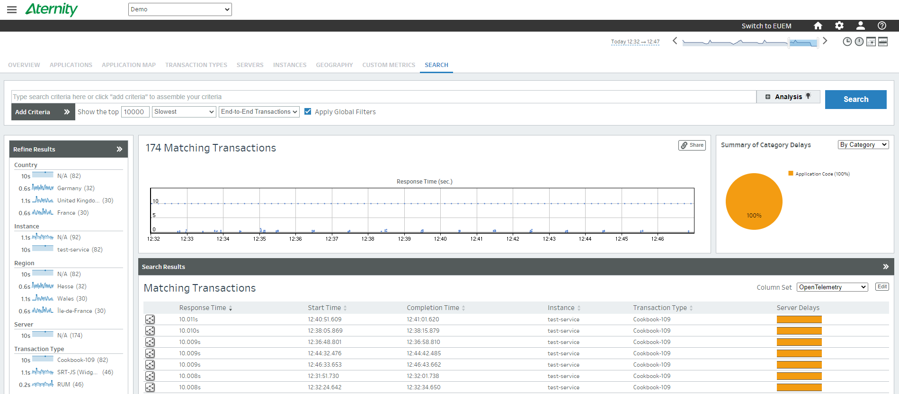

# 109-opentelemetry-export

In this cookbook the OpenTelemetry Collector receives OTLP-gRPC telemetry from a Go app and exports it using other protocols (OLTP-http, Jaeger and Zipkin) to different collectors: [APM OpenTelemetry Collector](https://hub.docker.com/r/aternity/apm-collector), Jaeger all-in-one and also a Zipkin all-in-one.

The Go app is a simple demo application provided by the [OpenTelemetry project](https://github.com/open-telemetry). In the cookbook it is set to run indefinitely to generate telemetry.


## Prerequisites

1. an APM account (SaaS)
2. a Docker host, for example [Docker Desktop](https://www.docker.com/products/docker-desktop)

## Step by Step

### 1. Get your CustomerID & SaaS Analysis Server Host details from the APM web console

Navigate to APM (for example [https://apm.myaccount.aternity.com](https://apm.myaccount.aternity.com)) > Agents > Install Agents:

1. Find your **CustomerID**, for example *12341234-12341234-13241234*
2. Grab **SaaS Analysis Server Host**, for example *agents.apm.myaccount.aternity.com*

Those information are required to activate the APM OpenTelemetry Collector container, passing via the environment variable `SERVER_URL`. 

### 2. Start the containers

Download a local copy of the files [docker-compose.yaml](docker-compose.yaml) and [otel-collector-config.yaml](otel-collector-config.yaml), for example in the directory `Tech-Community/109-opentelemetry-export`

Start the containers using the [docker-compose.yaml](docker-compose.yaml), for example with Bash:

```bash
cd Riverbed-Community-Toolkit/APM/109-opentelemetry-export

# Configure the environment variables for the APM OpenTelemetry Collector
export ATERNITY_SAAS_SERVER_HOST="agents.apm.myaccount.aternity.com"
export ATERNITY_CUSTOMER_ID="12341234-12341234-13241234"

docker-compose up
```

or with PowerShell:

```PowerShell
cd Riverbed-Community-Toolkit/APM/109-opentelemetry-export

# Configure the environement variable for the APM OpenTelemetry Collector
$env:ATERNITY_SAAS_SERVER_HOST="agents.apm.myaccount.aternity.com"
$env:ATERNITY_CUSTOMER_ID="12341234-12341234-13241234"

docker-compose up
```

### Open the APM web console to visualize and analyze the traces collected for every transaction



## Notes

### Stop the app and all the containers

Press CTRL + C in the shell where it is running.

Or in a shell, go to the folder where you keep the [docker-compose.yaml](docker-compose.yaml) and run:

```shell
docker-compose down
```

#### License

Copyright (c) 2022 Riverbed Technology, Inc.

The contents provided here are licensed under the terms and conditions of the MIT License accompanying the software ("License"). The scripts are distributed "AS IS" as set forth in the License. The script also include certain third party code. All such third party code is also distributed "AS IS" and is licensed by the respective copyright holders under the applicable terms and conditions (including, without limitation, warranty and liability disclaimers) identified in the license notices accompanying the software.
