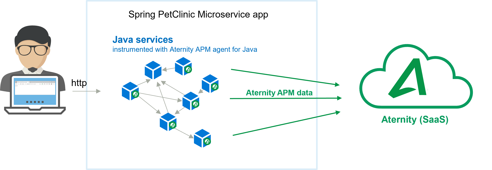
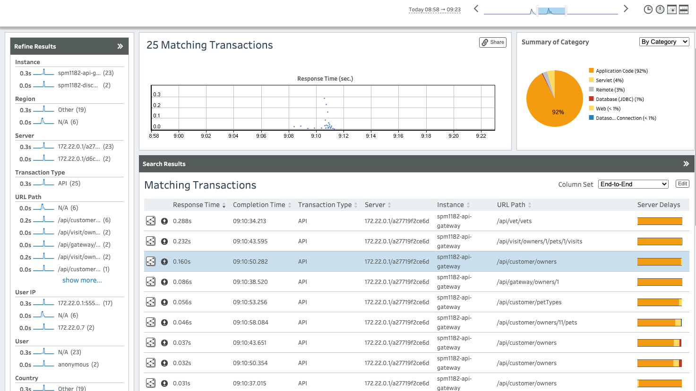

# 201-instrument-java-microservices-with-apm-agentless

This cookbook shows how to setup APM agentless for Java (the APM Java agent library for Linux) with auto-instrumentation on a Java app.

The demo app is the famous Java Community application called [Spring PetClinic Microservices](https://github.com/spring-petclinic/spring-petclinic-microservices), same app used in the [Cookbook 102: OpenTelemetry quickstart](../102-opentelemetry-spring-demo-app). The app is composed of multiple services that run in containers, like Config, Discovery Server, Customers, Vets, Visits and API.

Here, the [APM](https://www.riverbed.com/products/application-performance-monitoring) agent is injected in each service, enabling automatic instrumentation and performance monitoring. 



## Prerequisites

1. an APM account (SaaS)
2. a Docker host, for example [Docker Desktop](https://www.docker.com/products/docker-desktop)

## Step by Step

### Step 1: Connect to the APM webconsole

Navigate to the APM webconsole url (for example [https://apm.myaccount.aternity.com](https://apm.myaccount.aternity.com)) > AGENTS > Install Agents:

1. Find your **CustomerID**, for example *12341234-1234-1234-1234-123456789abc*
2. Grab **SaaS Analysis Server Host**, for example *agents.apm.myaccount.aternity.com*
3. Obtain the **psockets host name** replacing *agents* with *psockets*, for example *psockets.apm.myaccount.aternity.com*
4. Download the package **APM Agentless Instrumentation (Java)** (also available on [Riverbed support](https://support.riverbed.com/content/support/software/aternity-dem/aternity-apm.html), for example *aternity-apm-jida-linux-12.19.0_BL516*

### Step 2: Get the docker-compose

Download a local copy of the file [docker-compose.yml](docker-compose.yml), for example  [right-click here to download](https://raw.githubusercontent.com/riverbed/Riverbed-Community-Toolkit/refs/heads/master/APM/201-instrument-java-microservices-with-apm-agentless/docker-compose.yml) and save it in the directory `Tech-Community/201-instrument-java-microservices-with-apm-agentless`

In the [docker-compose.yml](docker-compose.yml), for each service, the auto-instrumentation configuration consists in few environment variables set with CustomerID and SaaS Analysis Server Host psockets endpoint, and a volume that mounts the agent.

```yaml
  cool-java-service:
    image: myapp/cool-java-service
    entrypoint: ["java", "-jar", "MyCoolService.jar"]
    environment:
      - RVBD_ANALYSIS_SERVER=${ATERNITY_SAAS_SERVER_HOST}
      - RVBD_CUSTOMER_ID=${ATERNITY_CUSTOMER_ID}
      - JAVA_TOOL_OPTIONS=-agentpath:/agent/lib/libAwProfile64.so
      - RVBD_AGENT_FILES=1
      - RVBD_APP_INSTANCE=cool-java-service
    volumes:
      - ./agent:/agent
```

The CustomerID and SaaS Analysis Server Host can be defined manually, replacing ATERNITY_SAAS_SERVER_HOST and ATERNITY_CUSTOMER_ID directly in the file like this:

```yaml
  cool-java-service:
    image: myapp/cool-java-service
    entrypoint: ["java", "-jar", "MyCoolService.jar"]
    environment:
      - RVBD_ANALYSIS_SERVER=psockets.apm.myaccount.aternity.com
      - RVBD_CUSTOMER_ID=12345678-abcd-1234-abcd-123456789012
      - JAVA_TOOL_OPTIONS=-agentpath:/agent/lib/libAwProfile64.so
      - RVBD_AGENT_FILES=1
      - RVBD_APP_INSTANCE=cool-java-service
    volumes:
      - ./agent:/agent
```


### Step 3: Start the containers

Open a shell

Go in the folder where you keep the [docker-compose.yml](docker-compose.yml) file you just configured. For example:

```shell
cd Riverbed-Community-Toolkit/APM/201-instrument-java-microservices-with-apm-agentless
```

Unzip the zip archive of the APM Java Agent package, it will be expanded in a subdirectory */agent*

```shell
unzip aternity-apm-jida-linux-xx.x.x_BLxxx.zip
```

Start the containers:

```shell
docker-compose up
```

### Step 4: Exercise the application

Browse http://localhost:8080 and click around to generate load and transactions that will be monitored by APM


### Step 5: Open the APM webconsole to visualize and analyze the traces collected for every transaction

View the entire applications:


Search transactions:



View transaction details:


## Notes 

### Stop the app and all the containers

Press CTRL + C in the shell where it is running.

Or in a shell, go to the folder where you keep the [docker-compose.yml](docker-compose.yml) and run:

```shell
docker-compose down
```

### Support

Please visit [Riverbed APM](https://www.riverbed.com/products/application-performance-monitoring)

#### License

Copyright (c) 2022 Aternity. The contents provided here are licensed under the terms and conditions of the MIT License accompanying the software ("License"). The scripts are distributed "AS IS" as set forth in the License. The script also include certain third party code. All such third party code is also distributed "AS IS" and is licensed by the respective copyright holders under the applicable terms and conditions (including, without limitation, warranty and liability disclaimers) identified in the license notices accompanying the software.
