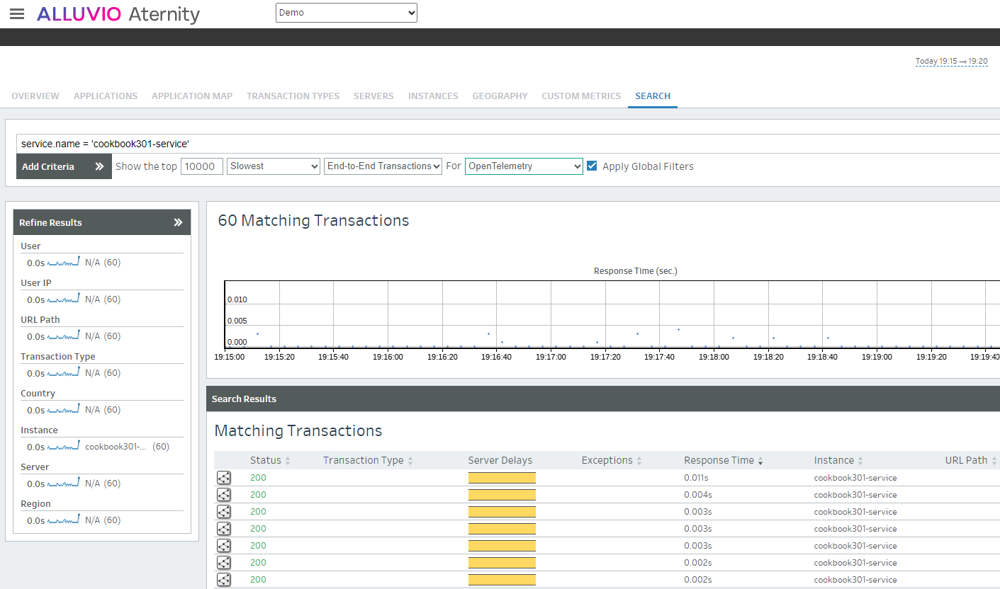

# 301-opentelemetry-on-kubernetes-with-apm-collector-daemonset-and-python-app

This cookbook shows how the [APM Collector](https://hub.docker.com/r/aternity/apm-collector) of ALLUVIO Aternity can be deployed as a daemonset on a Kubernetes cluster, so that an APM Collector pod will run on every node to receive traces from applications running on local pods, and send them to a SaaS account enabled for OpenTelemetry.

And for testing, the cookbook provides a simple web app written in Python/Flask, instrumented with OpenTelemetry Python, and that runs in a single container.
The pod is configured in the Kubernetes manifest to export the OpenTelemetry traces to the APM Collector.

The cookbook can be used with Kubernetes managed services in your favorite Cloud, like Azure AKS, AWS EKS or Google GKE.


## Prerequisites

1. a SaaS account for [ALLUVIO Aternity APM](https://www.riverbed.com/products/application-performance-monitoring) with a license for OpenTelemetry

2. a Kubernetes cluster ready and manageable using kubectl CLI

## Step 1. Get the details for ALLUVIO Aternity APM

In the APM webconsole, from the Home page, hit "Deploy Collectors" and "Install now" button (or else navigate via the traditional menu: CONFIGURE > AGENTS > Install Agents).

Then in the Linux agent panel, switch to the "Standard Agent Install" to find:

1. your **Customer Id**, for example *12341234-12341234-13241234*

2. your **SaaS Analysis Server Host**, for example *agents.apm.my_environment.aternity.com*

## Step 2. Get the cookbook and open a shell

1. Download the .yaml files of the cookbook, or ([download the full Tech Community zip archive](https://github.com/riverbed/Riverbed-Community-Toolkit/archive/refs/heads/main.zip))

2. Open a shell and go to your directory with the .yaml file

For example,

```shell
cd 301-opentelemetry-on-kubernetes-with-apm-collector-daemonset-and-python-app
```

## Step 3. Deploy the APM Collector

1. Configure the .yaml manifest

Edit the Kubernetes manifest [apm-collector-daemonset.yaml](apm-collector-daemonset.yaml) to configure the environment variables for the APM Collector:

- replace {{ALLUVIO_ATERNITY_APM_CUSTOMER_ID}} with the **Customer Id**, for example: *12312341234-1234-124356*

- replace {{ALLUVIO_ATERNITY_APM_SAAS_SERVER_HOST}} with the **SaaS Analysis Server Host**, for example: *agents.apm.my-account.aternity.com*


2. Deploy the daemonset

In the shell, execute the following command to deploy the daemonset on the Kubernetes cluster

```shell
kubectl apply -f apm-collector-daemonset.yaml
```

3. Wait few minutes and check the resources are ready

```shell
kubectl --namespace alluvio-aternity get daemonset

kubectl --namespace alluvio-aternity get pod
```

## Step 4. Configure and deploy the instrumented app

This simple Python/Flask web app is instrumented with the OpenTelemetry library for Python. It runs in a single container, and will be deployed on Kubernetes as a single Pod.

1. Check the app configuration for OpenTelemetry

In the manifest of the app, [cookbook301-app.yaml](cookbook301-app.yaml), the OpenTelemetry exporter is configured via the environment variables. The *Service Name* is set and the OpenTelemetry OTLP exporter configured to send traces the local APM Collector pod (listening on the node's hostIP on the standard port for OTLP/gRPC, 4317)

The configuration looks like this:

```yaml
      # Configure the service name for OpenTelemetry
      - name: OTEL_SERVICE_NAME
        value: cookbook301-service

      # Configure OpenTelemetry to export the traces the collector
      - name: NODE_IP
        valueFrom:
          fieldRef:
            apiVersion: v1
            fieldPath: status.hostIP
      - name: OTEL_EXPORTER_OTLP_TRACES_ENDPOINT
        value: "http://$(NODE_IP):4317"
```

2. Deploy the app

Execute the following commands:

```shell
# Deploy the app
kubectl apply -f cookbook301-app.yaml
```

After few seconds, a probe will start and generate regular http calls. For each call, the OpenTelemetry instrumentation will create a trace and export it.

3. Optionally - Check the logs of the app

Execute the following command in the shell:

```shell
kubectl logs cookbook301-app
```

When the app is running, the output looks like this:

```
> kubectl logs cookbook301-app
 * Debug mode: off
WARNING: This is a development server. Do not use it in a production deployment. Use a production WSGI server instead.
 * Running on all addresses (0.0.0.0)
 * Running on http://127.0.0.1:80
 * Running on http://192.168.159.238:80
Press CTRL+C to quit
192.168.138.18 - - [24/Aug/2023 10:09:09] "GET / HTTP/1.1" 200 -
192.168.138.18 - - [24/Aug/2023 10:09:14] "GET / HTTP/1.1" 200 -
```

## Step 5. Observe the traces in ALLUVIO Aternity APM webconsole 

In the APM webconsole, open the menu and go the "Search" view to find all the OpenTelemetry traces of the app. 
The view allows to filter the transactions based the attributes. 

For example the following query will match on the Service Name used by this application:

```query
service.name='cookbook301-service'
```

ALLUVIO Aternity APM collects every trace:


