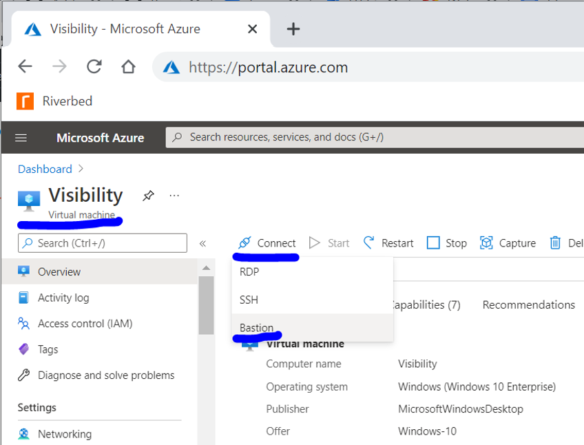

# Riverbed Community Cookbooks - AppResponse Simple Demo

 

Deploy [Riverbed AppResponse](https://www.riverbed.com/products/npm/appresponse) in your own Azure Cloud subscription in just few clicks with the Riverbed Community Toolkit provided by the [Riverbed Community](https://community.riverbed.com/).

Please have a try and join the [Riverbed Community](https://community.riverbed.com/) to discuss.

## Deployment Steps

1. Hit the "Deploy to Azure" button above
2. Fill usual fields:
    - Subscription
    - Resource Group: create a new, e.g. Riverbed-AppResponse-Demo
    - Region: Select an Azure Region
3. Fill the parameters
    - Version: Select the AppResponse version among the version supported by the template
    - Appliance Source Image Blob Uri: uri of the Blob containing the VHD of AppResponse. Contact [Riverbed TAC](https://support.riverbed.com) to get a standard uri with a temporary SAS Token.
    - Appliance Size: Size of the Azure VM, Standard_B8ms is a minimum
    - Demo Jumpbox Username: Default is riverbed-community
    - Demo Jumpbox Password: Set a password with enough complexity (8 characters lengths, 1 or more numeric, 1 or more special characters)
4. Hit "Review + create", then hit "Create"
5. Wait for the deployment, approximately 30 min to 1h depending on the region.

## Usage

When the deployment is done, grab the the default admin credential from the deployment outputs. They will be required to log on the appliance webconsole

A simple topology with an AppResponse VM appliance and a Windows VM will have been created.

In the Azure Portal, navigate to the resource group. Then find the virtual machine named "Visibility" and connect via the Bastion using the Jumpbox username and password set in the deployment steps.

On the Jumpbox you can launch the web browser, navigate to the AppResponse webconsole url https://10.100.5.51 and log in with the initial admin credential of the appliance (grabbed earlier from the deployment output).

## Notes

`Tags: Riverbed,Visibility,NPM,Network,Performance,Monitoring,AppResponse,Packet,Capture`
