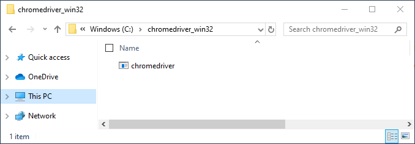
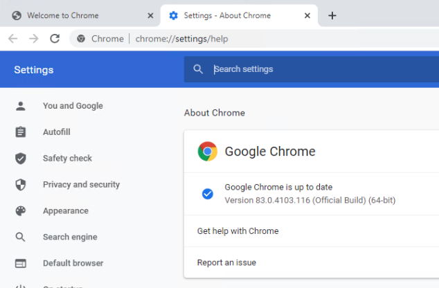

# Web Selenium ROBOT Cookbook

This Web Selenium robot can play Synthetic Test in a web browser in the same conditions as real users.

Capabilities summary:

- Windows machine
- Synthetic Test in a web-browser in Edge or Chrome (Selenium automation with Python scripts)

The next paragraph explains how to setup from scratch on a Windows machine. It inclused the installation of Riverbed and Aternity agents.

## Prerequisites

- a fresh machine with Windows 10 x64 and a user account with Administrator permission
- a [Riverbed NetIM](https://www.riverbed.com/products/steelcentral/infrastructure-management.html) instance for Synthetic Test orchestration
- connectivity between the Windows machine and the NetIM Core node

## Preparation

### 1. Basic components

1. Download the [Riverbed Community Toolkit](https://github.com/riverbed/Riverbed-Community-Toolkit/archive/master.zip). Extract it on the C: drive and rename the folder "Riverbed-Community-Toolit" (removing the "-master" at the end)


2. Download a install a decent code editor, for example [Visual Studio Code - x64 System Installer](https://code.visualstudio.com/#alt-downloads)

3. Download and install [Python](https://www.python.org). For example [Python 3.8.83 x64](https://www.python.org/ftp/python/3.8.3/python-3.8.3-amd64.exe)
> - Check the installer option to Add Python to PATH
> - Hit Custom Install button and select "install for all users" in the Advanced Install options

### 2. NetIM agent

1. Download the NetIM TestEngine Agent from the **NetIM Manager node**

The installer package can be found on the NetIM Manager node in the following directory: [/data1/riverbed/NetIM/{{version}}/external/TestEngine/](/data1/riverbed/NetIM/{{version}}/external/TestEngine/) (replacing {{version}} according to your environemt)

The folder contains the package for Linux and Windows (TestEngine-windows.zip, TestEngine-linux.zip). With your favorite SFTP tool, grab the zip file for Windows.

2. Install the NetIM TestEngine Agent

On your Windows machine, **extract TestEngine-windows.zip on C:**

Run the **install.bat** in a PowerShell (with Administrator privilege).

### 3. Edge specifics

1. Download and install [Microsoft Edge](https://www.microsoft.com/en-us/edge) (Chromium version)

2. Launch Edge and open the url [edge://settings/help](edge://settings/help) to check the version that is running. For example version 83:


3. Download the [Driver](https://developer.microsoft.com/en-us/microsoft-edge/tools/webdriver/#downloads) for **Windows 64 bits** and extract it to c:\. 

For example the URL of the version **83.0.478.56** for Windows 64bits is https://msedgedriver.azureedge.net/83.0.478.56/edgedriver_win64.zip

After extraction the driver should be in the following path: C:\edgedriver_win64\msedgedriver.exe


4. Install edge selenium libraries for Python with pip. Open a Windows PowerShell (Admin) and run the following command:

```PowerShell
pip install msedge-selenium-tools
```

### 4. Chrome specifics

1. Download and install [Google Chrome](https://www.google.com/chrome/)

2. Download the [Driver](https://chromedriver.chromium.org/downloads) for **Windows 32 bits** and extract it to c:\. 

For example the URL of the version **83.0.4103.39** for Windows 32 bits is https://chromedriver.storage.googleapis.com/83.0.4103.39/chromedriver_win32.zip

After extraction the driver should be in the path: C:\chromedriver_win32\chromedriver.exe



3. Install selenium libraries for Python with pip

Open a Windows PowerShell (Admin) and run

```PowerShell
pip install selenium
```

4. Install selenium libraries for Python with pip



## License

The scripts provided here are licensed under the terms and conditions of the MIT License accompanying the software ("License"). The scripts are distributed "AS IS" as set forth in the License. The script also include certain third party code. All such third party code is also distributed "AS IS" and is licensed by the respective copyright holders under the applicable terms and conditions (including, without limitation, warranty and liability disclaimers) identified in the license notices accompanying the software.

## Copyright (c) 2020 Riverbed Technology, Inc.
