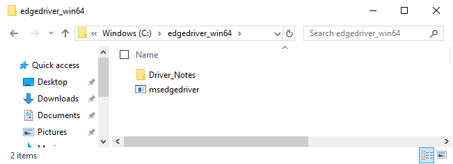

# Web Selenium ROBOT Cookbook

This Web Selenium robot can play Synthetic Test in a web browser in the same conditions as real users.

Capabilities summary:

- Windows machine
- Synthetic Test in a web-browser in Edge or Chrome (Selenium automation with Python scripts)

The next paragraph explains how to setup from scratch on a Windows machine. It include the installation of Riverbed NetIM agent.

## Prerequisites

- a fresh machine with Windows 11 x64 and a user account with Administrator permissions
- a [Riverbed NetIM](https://www.riverbed.com/products/steelcentral/infrastructure-management.html) instance for Synthetic Test orchestration
- connectivity between the Windows machine and the NetIM Core node

## Preparation

### 1. Basic components

1. Download the [Riverbed Community Toolkit](https://github.com/riverbed/Riverbed-Community-Toolkit/archive/master.zip). Extract it on the C: drive and rename the folder "Riverbed-Community-Toolit" (removing the "-master" at the end)


2. Download and install a decent code editor, for example [Visual Studio Code - x64 System Installer](https://code.visualstudio.com/#alt-downloads)

3. Download and install [Python](https://www.python.org). For example [Python 3.12.0 x64](https://www.python.org/downloads/)
> - Check the installer option to Add Python to PATH
> - Hit Custom Install button and in the Advanced Install options check to box to select"Install Python for all users"

4. Install **selenium 4** libraries for Python with pip (check [Selenium](https://www.selenium.dev/) and [pip](https://pypi.org/project/selenium/) for details, the latest version is 4.15.2 as of nov. 2023). Open a Windows PowerShell (Admin) and run the following command:

```PowerShell
pip install selenium
```

### 2. Edge specific

1. Launch Edge and open the url [edge://settings/help](edge://settings/help) to check the version that is running (if not already there, fetch and install from [here](https://www.microsoft.com/en-us/edge)). 

For example Version 119.0.2151.72 (Official build) (64-bit).

2. Download the corresponding [MS Edge WebDriver](https://developer.microsoft.com/en-us/microsoft-edge/tools/webdriver/#downloads) for **Windows 64 bits** and extract it to c:\. 

After extraction the driver should be in the following path: C:\edgedriver_win64\msedgedriver.exe



### 3. Chrome specific

1. Download and install [Google Chrome](https://www.google.com/chrome/)

2. Launch Chrome and open the url [chrome://settings/help](chrome://settings/help) to check the version number

3. Download the corresponding [Chrome WebDriver](https://googlechromelabs.github.io/chrome-for-testing/) matching the version for **Windows 64 bits** and extract it to c:\. 

After extraction the driver should be in the path: C:\chromedriver-win64\chromedriver.exe

### 4. NetIM agent

1. Download the NetIM TestEngine Agent installer from the **NetIM Core node**

The installer package can be found on the **NetIM Core node** in the directory /data1/riverbed/NetIM/**{{version}}**/external/TestEngine (replacing {{version}} to match your environment) or /data1/riverbed/NetIM/**latest**/external/TestEngine.

The folder contains the package for Linux and Windows (TestEngine-windows.zip, TestEngine-linux.zip). With your favorite SFTP tool, grab the zip file for Windows or use scp from the shell.

For example:

```PowerShell
scp netim_admin_username@netim_servername:/data1/riverbed/NetIM/latest/external/TestEngine/TestEngine-*.zip .
```

2. Install the NetIM TestEngine Agent

On your Windows machine, **extract TestEngine-windows.zip on C:**

Run the **install.bat** in a PowerShell (with Administrator privilege).

3. Change the service account

By default, the NetIM agent run as Local System. It must be changed to run Selenium test.

In the Windows Services (search Services from the Start Menu), edit the Properties of the service "Riverbed NetIM Test Engine", go to the tab "Log On", select "This account" and put your user account info (username and password). For example for a local user, put: .\yourusername

Then, restart the service and the agent will be ready to run the synthetic test.


## License

The scripts provided here are licensed under the terms and conditions of the MIT License accompanying the software ("License"). The scripts are distributed "AS IS" as set forth in the License. The script also include certain third party code. All such third party code is also distributed "AS IS" and is licensed by the respective copyright holders under the applicable terms and conditions (including, without limitation, warranty and liability disclaimers) identified in the license notices accompanying the software.

## Copyright (c) 2020 Riverbed Technology, Inc.
