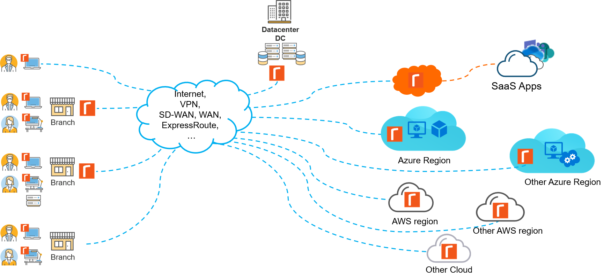

# Community Cloud Cookbooks for Riverbed Acceleration

Even hosted in the Cloud like Azure or AWS your workloads may suffer from latency and network/application protocol inefficiency. Moreover your lift and shift migration, multi-regional, hybrid-cloud or multi-cloud architectures, all interconnected with SD-WAN or dedicated routes or peering expand the demand on bandwidth.

To improve performance, the Riverbed Acceleration solution, aka SteelHead, can be deployed inside Azure VNET and chained in the network path of applications and services. This enables the inbound and outbound traffic to be accelerated with other locations where the solution is also deployed. For example: mobility to VPN, branch or on-prem datacenter to VNET, VNET to other Cloud providers (e.g. VNET to AWS VPC) or VNET to other peered VNET.

Riverbed provides to the user community some Cloud architecture and implementation details to integrate Acceleration in the cloud with Service Chain, Interception in the Cloud, Scale,"Fail-to-Wire", Monitoring ... These and other topics will be covered using cookbooks that explain concepts and examples of code to help you do it yourself.

Any contributions, feedbacks and comments are welcome!

## Riverbed Acceleration for Any Cloud

The Riverbed Acceleration solution is the market leader with its unique technology capable of boosting application and workload performance as well as reducing network bandwidth consumption, effects of latency, and also costs.

Well known for optimization of WAN traffic and on-prem hosted applications, the acceleration solution can also optimize across any network where applications are hosted in cloud infrastructure.

The technical solution exists in different form factors so that it can be deployed and chained in the network path, both client side and server side.

### Cookbooks for AWS

- [AWS-101 - Deploying Acceleration in an existing VPC having a gateway appliance (VPN or SD-WAN)](AWS-Cloud-Cookbooks/101-service-chain-gw-appliance.md)
- [AWS-102 - Create VPC, Subnets, Workload, Acceleration and service chain with gateway appliance](AWS-Cloud-Cookbooks/102-vpc-and-service-chain-gw-appliance.md)

*Other topcis in preparation: AWS Transit Gateway, VPC ingress routing*

### Cookbooks for Azure

- [Azure-101 - Chaining Acceleration in a VNET having a gateway appliance (VPN or SD-WAN)](Azure-Cloud-Cookbooks/101-service-chain-gw-appliance)
- [Azure-102 - Acceleration Load-Balancing and Scale Out in Azure](Azure-Cloud-Cookbooks/102-scale-out)
- [Azure-103 - Cluster of 2 active Cloud SteelHead appliances](Azure-Cloud-Cookbooks/103-deploy-active-active)
- [Azure-300 - PowerShell script to configure Route Tables for Service Chaining](Azure-ServiceChain)

*Other topics in preparation: - Active/Passive, Monitoring, VNET to VNET Acceleration, MTTR/Availability, SteelConnect SD-WAN, 3rd party SD-WAN, ExpressRoute, AzureVWAN, Azure Virtual Gateway*

## License

Copyright (c) 2019 Riverbed Technology, Inc.
The scripts provided here are licensed under the terms and conditions of the MIT License accompanying the software ("License"). The scripts are distributed "AS IS" as set forth in the License. The script also include certain third party code. All such third party code is also distributed "AS IS" and is licensed by the respective copyright holders under the applicable terms and conditions (including, without limitation, warranty and liability disclaimers) identified in the license notices accompanying the software.
